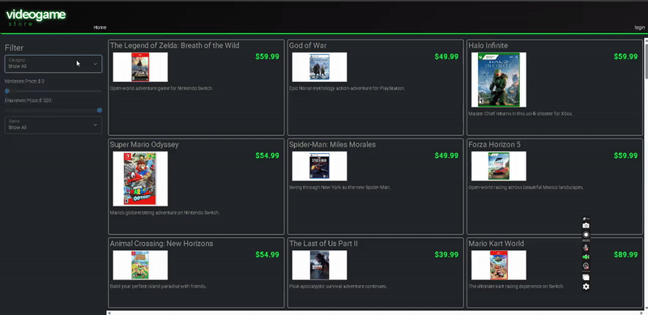
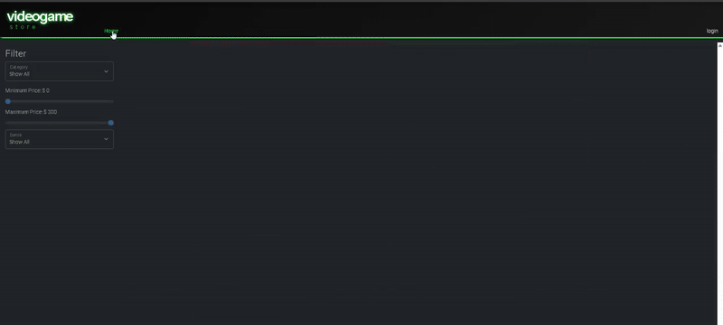
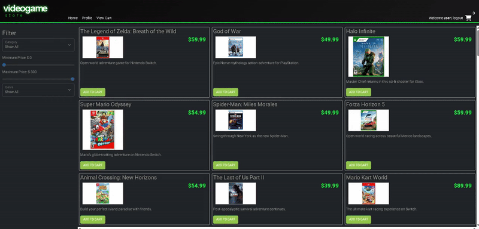

# Video Game Store API

## Description of the Project

Video Game Store is a Spring Boot REST API backend for a VideoGameStore web application. 
The API allows users to browse games by category, search and filter products, manage shopping carts, and complete checkout orders.
Users can login, manage their profiles, and shop for video games while admins can manage categories and products.
---
## User Stories
- As a user, I want to view, create, update, and delete product categories so that products can be browsed and updated accurately.
- As a user, I want the product search to return accurate results so that I can find the products I'm looking for.
- As a user, I want to manage my shopping cart (CRUD) so that I can add items to my cart and checkout.
- As a user, I want to view profile so that I can manage my profile details.
- As a user, I want to checkout my shopping cart so that I can complete purchases.
- As a developer, I want a README file so that anyone can understand the project that has been built.
- As a developer, I want API and Unit tests so that I can verify my code works correctly and easily test all endpoints.
- As an admin, I want to manage categories (create, update, delete) so that I can update the inventory.
- As an admin, I want to update products without creating duplicates so that the product inventory is accurate.
---

## Setup

### Prerequisites
- **IntelliJ IDEA**: Download from [JetBrains](https://www.jetbrains.com/idea/download/)
- **Java SDK 17** or higher
- **MySQL 8.0** or higher
- **Insomnia** (for API testing)

### Running the Application
1. Open IntelliJ IDEA
2. Select "Open" and navigate to the project directory
3. Wait for IntelliJ to index files and resolve dependencies
4. Configure `application.properties` with your MySQL credentials:
5. Find the main class: `src/main/java/org/yearup/EasyshopApplication.java`
6. Right-click and select 'Run EasyshopApplication'
---

## Technologies Used
- **Java 17**
- **Spring Boot**
- **MySQL 8.0**
- **Insomnia** for API testing
---
## Demo
### Categories API
Showing different products from each category.

### Product Search
Demonstrating search functionality with filters.

### Login & Profile
Demonstrating logging in and updating profile.

### Shopping Cart
Adding items to cart, viewing cart, and clearing cart.

---
## Future Work
- **Admin Frontend**: Add admin functionality to the frontend (create, update, delete categories/products)
- **Checkout Frontend**: Add checkout functionality to the frontend
- **Payment Integration**: Add mock payment processor
---
## Resources
- [Spring Security - Check User Role](https://www.baeldung.com/spring-security-check-user-role)
- [Java SQL Timestamp](https://www.tutorialspoint.com/java-sql-timestamp-valueof-method-with-example)
---

## Acknowledgments
- Thank you to Raymond Maroun for continuous support and guidance throughout this project.
